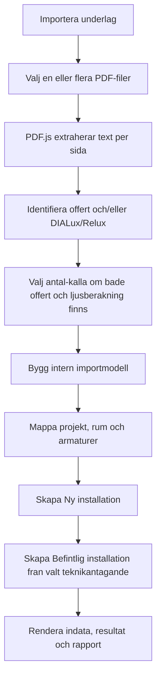

# Importlogik for `lcc.html`

Senast uppdaterad: 2026-04-28

Detta dokument beskriver den importlogik som finns implementerad i `lcc.html`.
Syftet ar att gora det enkelt att granska hur PDF-underlag tolkas, hur falt mappas
och hur Ny installation respektive Befintlig installation byggs i LCC-modellen.

Dokumentet beskriver nulaget i koden. Langst ned finns en lista over kanda
begransningar och utvecklingspunkter.

## Kort oversikt

Importen ar byggd for tre PDF-scenarier:

- Aura Light-offert
- DIALux-/Relux-ljusberakningsrapport
- Aura Light-offert och DIALux-/Relux-ljusberakningsrapport samtidigt

Nar importen kor skapas forst en intern importmodell. Den modellen anvands sedan
for att fylla i:

- Projektinformation
- Ny installation
- Befintlig installation
- Rumstyper
- Armaturer
- Antal, priser, effekt och styrningsantaganden dar datan kan hittas

Den viktigaste matchningsnyckeln mellan offert och DIALux ar:

| Kalla | Matchningsfalt |
|---|---|
| DIALux | `Register`, exempelvis `L01` eller `L01S` |
| Offert | `Offertradens godsmarke`, exempelvis `L01` eller `L01S` |

Om DIALux-raden har `Register L01` och offerten har
`Offertradens godsmarke: L01` kopplas raderna ihop.

## Huvudflode



## Importflode steg for steg

1. Anvandaren klickar pa `Importera underlag`.
2. Appen oppnar en filvaljare for PDF-filer.
3. En eller flera PDF-filer kan valjas samtidigt.
4. PDF-text extraheras i webblasaren via PDF.js.
5. Varje PDF klassas som offert, DIALux-/Relux-rapport eller okand PDF utifran textinnehall.
6. Om bade offert och ljusberakning finns far anvandaren valja om armaturantal ska hamtas fran offert eller ljusberakningen.
7. Appen bygger en importmodell via `buildPdfImportModel()`.
8. Importmodellen appliceras pa kalkylen via `applyImportModel()` och `applyImportedProject()`.
9. Befintliga installationer i vyn ersatts om anvandaren bekraftar importen.
10. Ny installation och Befintlig installation skapas utifran importmodellen.
11. Resultatvyn och rapporten renderas fran samma berakningsmodell som manuell inmatning.

## Dokumentidentifiering

Importen avgor dokumenttyp med textbaserade regler:

| Dokumenttyp | Nuvarande igenkanning |
|---|---|
| Aura Light-offert | Texten innehaller `Offertradens godsmarke` eller `Offertnummer` |
| DIALux-/ljusberakningsrapport | Texten innehaller `Anvandarprofil`, `Created with DIALux` eller `Berakningsplan`, och samtidigt `Armaturlista` |
| Relux-ljusberakningsrapport | Texten innehaller Relux-liknande projekt- och armaturmarkorer, exempelvis `.rdf`, `Leuchten- und Raumelemente`, `Stuckliste`, `Bodenflache`, `Gesamtleistung`, `Bestell Nr.`, `Leuchtenname` och `Bestuckung` |

Importlaget sattes sedan till:

| Importlage | Villkor |
|---|---|
| `both` | Minst en offert och minst en DIALux-/Relux-rapport hittas |
| `offer-only` | Endast offert hittas |
| `dialux-only` | Endast DIALux-/Relux-rapport hittas |
| `none` | Inget dokument kan klassas |

## Textutvinning fran PDF

PDF-texten extraheras med PDF.js:

- varje sida lases separat
- textrader sorteras efter Y-position och X-position
- texter pa samma rad slas ihop
- resultatet blir en radbaserad textmodell som parserfunktionerna arbetar vidare med

Detta betyder att importen ar beroende av att PDF:en innehaller riktig text. Skannade
PDF:er eller PDF:er med ovanlig textordning kan ge ofullstandig import.

## Prioritetsregler for projektfalt

| Data | Primar kalla | Fallback |
|---|---|---|
| Projektnamn | DIALux | Offert, befintligt faltvarde, `Importerat projekt` |
| Datum | Offertdatum | DIALux-datum, befintligt faltvarde, dagens datum |
| Handlaggare | DIALux | Offertens `Var referens`, befintligt faltvarde, tomt |
| Rumstruktur | DIALux | Generiska rum fran offertens prisrader |
| Rumsarea | DIALux `Yta ... m2` | `0` |
| Armaturtyp/benamning | Offertens benamning vid matchning | DIALux-artikelnamn |
| Antal armaturer | Valbart: offert eller DIALux | Om bara en kalla finns anvands den |
| Armaturpris | Offertens a-pris | `0` |
| Effekt W/st | DIALux | `0` vid offert-only |
| Monteringskostnad | Standardvarde | `0` |
| Underhall ny installation | Standardvarde | `0` |

## Offertparser

Offertparsern finns i `parseAuraOffer(text)`.

Den letar fram prisrader genom att hitta:

- `Offertradens godsmarke: LXX`
- offertradens huvudrad ovanfor godsmarkesraden
- antal
- a-pris
- benamning

Nuvarande registerregel accepterar godsmarken i format:

```text
L01
L01S
L02
...
```

Varje hittad godsmarkesrad lagras som en prisrad:

| Intern data | Fran offert |
|---|---|
| `register` | `Offertradens godsmarke` |
| `quantity` | Antal pa offertraden |
| `price` | A-pris pa offertraden |
| `label` | Benamning/textrader kopplade till offertraden |

Alla priser tolkas som SEK i koden och konverteras sedan till vald marknad via aktuell
vaxelkurs i marknadspreseten.

## DIALux-parser

Ljusberakningsimporten gar via `parseLightingReport(text)`. Funktionen valjer
`parseReluxReport(text)` nar underlaget ar en Relux-rapport, annars
`parseDialuxReport(text)`.

DIALux-parsern finns i `parseDialuxReport(text)`.

Den letar rum genom rubrikmonster i stil med:

```text
Rumsnamn (Ljusscen 1)
Sammanfattning
```

Ett rum importeras bara om det innehaller `Armaturlista`.

Fran varje rum forsoker importen hamta:

| Intern data | Fran DIALux |
|---|---|
| Rumsnamn | Rubriken fore `(Ljusscen 1)` |
| Area | `Yta ... m2` |
| Anvandarprofil | `Anvandarprofil:` |
| Armaturregister | `Register`, exempelvis `L01` |
| Artikelnummer | Aura Light-artikelnummer i armaturlistan |
| Armaturtyp | Artikelnamn/benamning i armaturlistan |
| Antal | Antal armaturer i armaturlistan |
| Effekt | Effekt per armatur i W |

Om `Register` saknas finns en begransad fallback som kan inferera vissa register fran
armaturens namn eller artikelnummer. I nulaget finns bland annat en specialregel for
vissa `Ceos Evo PE L1500 Sensor`-rader som kan mappas till `L01S`.

## Relux-parser

Relux-parsern finns i `parseReluxReport(text)` och ar i v1 byggd for Relux PDF-exporter
med extraherbar text, inte native Relux-projektfiler.

Fran Relux forsoker importen hamta:

| Intern data | Fran Relux |
|---|---|
| Projektnamn | `Objekt` eller forsta projektraden |
| Datum | `Datum : dd.mm.yyyy`, konverterat till `yyyy-mm-dd` |
| Handlaggare | `Bearbeiter` |
| Rumsnamn | Rubrik i stil med `1 Raum 1` |
| Rumsarea | `Bodenflache ... m2` |
| Armaturregister | Stabil fallback `RELUX-TYP-1`, `RELUX-TYP-2` osv. |
| Artikelnummer | `Bestell Nr.` |
| Armaturtyp | `Leuchtenname` |
| Antal | `Anz.`, exempelvis `8x` |
| Effekt | `Bestuckung`, exempelvis `1 x LED 28 W / 4000 lm` |

Eftersom Relux-exemplet saknar DIALux-liknande register/littera anvands Relux typnummer
som intern fallbacknyckel. Matchning mot offert kan fortfarande ske via artikelnummer i
`findOfferRowForFixture(...)`.

## Rumslogik

Nar DIALux finns skapas en rumstyp per relevant DIALux-avsnitt.

Rumsnamn och anvandarprofil anvands for att mappa mot LCC-modellens byggnads- och
rumstyper.

| Text i DIALux | Mappas till |
|---|---|
| `rwc`, `wc`, `toalett`, `restroom` | `KONTOR` / `WC` |
| `korridor`, `corridor`, `touchdown`, `work lounge` | `KONTOR` / `Korridor` |
| `demo`, `konferens`, `conference`, `meeting` | `KONTOR` / `Konferensrum` |
| `library`, `tyst`, `arbetsplatser`, `kontor`, `office` | `KONTOR` / `Storkontor > 12 kvm` |
| Inget matchande nyckelord | `KONTOR` / `Storkontor > 12 kvm` |

Antal rum satts i nulaget till `1` per importerad rumstyp.

## Armaturmappning

Den praktiska mappningen for armaturer ar:

| DIALux | Offert | Falt i `lcc.html` | Styrande regel |
|---|---|---|---|
| `.st` / antal i armaturlista | Antal | `Antal (st)` | Valbart i importpanelen. Om bada underlag finns kan anvandaren valja offert eller DIALux. |
| `P` / watt per armatur | - | `Effekt (W/st)` | DIALux styr. Vid offert-only blir effekten `0`. |
| `Artikelnamn` | `Benamning` | `Armaturtyp` | Offertens benamning styr nar matchning via godsmarke/register finns. Annars DIALux. |
| - | `A-pris` | `Armaturpris` | Offerten styr. Saknas offert eller prisrad blir priset `0`. |
| `Register` | `Offertradens godsmarke` | Matchningsnyckel | Anvands for att koppla ihop DIALux-rad och offertrad. |

### Antalsregel

Antal armaturer styrs av valet `Antal (st) armaturer hamtas fran`.

| Importlage | Regel |
|---|---|
| Bara offert | Antal hamtas fran offerten |
| Bara DIALux/Relux | Antal hamtas fran ljusberakningen |
| Bade offert och DIALux/Relux | Anvandaren valjer offert eller ljusberakning vid import |

Nar importen redan ar gjord kan valet andras i importpanelen. Da byggs importmodellen
om fran senast importerad PDF-text och installationerna uppdateras.

## Ny installation

Ny installation skapas fran importmodellens rum och armaturer.

For varje ny armatur satts:

| Falt | Nuvarande logik |
|---|---|
| Armaturtyp | Offertbenamning om matchad, annars DIALux-benamning |
| Antal | Offert eller DIALux beroende pa valt antalunderlag |
| Armaturpris | Offertens pris, annars `0` |
| Montering | `0` |
| Effekt | DIALux-effekt, annars `0` |
| Styrning | Infereras fran armaturtext/register |
| Reduktionsfaktor | Beraknas fran byggnads-/rumstyp och styrning |
| Underhall | `0` |

### Styrningsinferens

Nuvarande styrningsregler for ny installation:

| Text i register/benamning | Styrning |
|---|---|
| `sensor`, `msensor`, `l01s` | Dagsljus-/narvarologik (`daylight`) |
| `dali` | Manuell styrning (`manual`) |
| Inget matchande | Ingen styrning (`none`) |

Reduktionsfaktorn hamtas fran LCC-modellens byggnads- och rumstypsfaktorer:

- `none`: `1`
- `manual`: manuell faktor
- `presence`: manuell faktor multiplicerat med narvarofaktor
- `daylight`: manuell faktor multiplicerat med narvaro- och dagsljusfaktor

## Befintlig installation

Befintlig installation skapas som en kopia av Ny installationens rum och armaturantal,
men med valt teknikantagande for aldre installation.

Nuvarande teknikpresets:

| Ar | Teknik | Effektfaktor | Underhall |
|---|---|---:|---:|
| 1995 | T8 med konventionellt driftdon | 2,4x | 140 kr/ar |
| 2000 | T8 HF utan styrning | 2,1x | 120 kr/ar |
| 2006 | T5/T8 HF utan styrning | 1,8x | 100 kr/ar |
| 2010 | T5 HF utan styrning | 1,55x | 80 kr/ar |
| 2015 | Tidig LED utan avancerad styrning | 1,35x | 35 kr/ar |
| 2020 | Aldre LED-losning | 1,15x | 20 kr/ar |

For befintlig installation satts:

| Falt | Nuvarande logik |
|---|---|
| Rum | Samma som Ny installation |
| Antal armaturer | Samma som Ny installation |
| Armaturpris | `0` |
| Montering | `0` |
| Effekt | Ny effekt multiplicerad med vald teknikfaktor |
| Styrning | `none` |
| Reduktionsfaktor | `1` |
| Underhall | Underhall fran valt teknikpreset |

## Import med bade offert och DIALux

Nar bade offert och DIALux importeras samtidigt:

- DIALux styr rumstruktur, area, effekt och teknisk armaturinformation.
- Offert styr armaturbenamning och armaturpris nar `Offertradens godsmarke` matchar DIALux `Register`.
- Antal styrs av anvandarens val: offert eller DIALux.
- Om en DIALux-rad saknar matchande offertpris satts priset till `0`.
- Saknade prisrader redovisas i importstatus.

Detta ar det mest kompletta importlaget.

## Offert-only

Om endast offert importeras:

- Projekt- och armaturdata hamtas efter basta formaga.
- Importen skapar generiska rum baserat pa offertens godsmarkesrader.
- Rumsnamnet blir i nulaget `Register LXX`.
- Antal och pris hamtas fran offerten.
- Effekt satts till `0`, eftersom DIALux saknas.
- Styrning satts till `none`, eftersom teknisk styrningsdata saknas.
- Befintlig installation skapas med samma antal men effekt `0`.

Det betyder att offert-only i nuvarande kod framfor allt ar anvandbart for att snabbt
fa in pris- och armaturbenamningar. For komplett energi- och LCC-berakning behover
effekt och styrning kompletteras manuellt eller via framtida PIM-koppling.

## DIALux-/Relux-only

Om endast DIALux eller Relux importeras:

- Rum, armaturtyp, antal, effekt och area hamtas efter basta formaga.
- Armaturpris satts till `0`, eftersom offert saknas.
- Importstatus informerar om att priser saknas.
- Befintlig installation skapas fran Ny installation enligt valt teknikantagande.

Det betyder att DIALux-/Relux-only ger energimodell och rumsstruktur, men inte komplett
investeringskostnad.

## Valuta och marknad

Marknadspresets styr valuta, vaxelkurs och standardvarden for kalkylforutsattningar.

| Preset | Valuta | Prisdata i offert tolkas som | Kommentar |
|---|---|---|---|
| SE | SEK | SEK | Ingen valutakonvertering |
| NO | NOK | SEK -> NOK | Konverteras med presetens vaxelkurs |
| DE | EUR | SEK -> EUR | Konverteras med presetens vaxelkurs |
| EU | EUR | SEK -> EUR | Konverteras med presetens vaxelkurs |

Funktionen `moneyFromSEK()` anvands for att konvertera offertpriser och underhall fran
SEK till vald marknad.

## Aktuell eltariff

Knappen `Hamta aktuell eltariff` ar inte PDF-import, men ligger i samma panel eftersom
den paverkar kalkylforutsattningarna.

Nuvarande flode:

1. `refreshLatestElectricityAssumptions()` anropas.
2. Appen anropar lokal hjalptjanst pa `http://127.0.0.1:8765`.
3. Endpoint: `/api/market-assumptions?preset=SE|NO|DE|EU`.
4. Hjalptjansten hamtar data fran Nord Pool.
5. Appen uppdaterar `1.3 Elpris` och `1.4 Elprisokning/ar (%)`.

Hjalptjansten finns i:

```text
market_data_proxy.py
```

Knappen `Aterstall forval` aterstaller kalkylforutsattningarna till inbyggda
standardvarden for vald marknad.

## Visa i resultat

I importpanelen finns valet `Visa i resultat`:

- `Bada`
- `Befintlig`
- `Ny`

Detta paverkar vilka installationer som visas i resultatvyn. Det paverkar inte
PDF-parsningen eller den importerade grunddatan.

Standard ar `Bada`.

## Sparad kalkyl

`Spara` och `Ladda sparad kalkyl` ar ett separat flode fran PDF-importen.

Nuvarande sparformat ar CSV, med semikolonseparerade rader:

```text
section;installation_index;room_index;luminaire_index;field;value
```

Sparad kalkyl innehaller bland annat:

- projektfalt
- kalkylforutsattningar
- marknad och sprak
- installationer
- rumstyper
- armaturer
- valt teknikpreset
- valt antalunderlag
- valt resultatfilter

Observera att sjalva PDF-filerna inte sparas i kalkylfilen. Under pagaende session
sparas daremot extraherad PDF-text i minnet sa att importen kan byggas om om anvandaren
byter antalunderlag.

## Hallbar mappning mellan offert och DIALux

Analys av mapparna `Bror`, `Greve`, `Volvo` och `Volvo2` visar att importen bor anvanda
foljande prioritering:

1. Primar matchningsnyckel ar DIALux `Register` / danska `Indeks` mot offertens
   `Offertradens godsmarke` / `Quote row's goods label`.
2. Specialmarken som `LI-U04D` och `LI-U06A` normaliseras till `U04D` respektive
   `U06A`, eftersom DIALux-raderna anvander samma U-nycklar.
3. Om register saknas eller avviker anvands artikelnummer som fallback. Exempel:
   DIALux `29069305529` kan matcha offertens `29069305529-1`.
4. Vid DIALux-only skapas rum fran DIALux-rum nar dessa finns. Om rapporten saknar
   rumsvisa armaturlistor men har en total armaturlista skapas ett samlat rum
   `DIALux armaturer`.
5. Vid offer-only skapas ett samlat rum `Offertpositioner`, dar varje offertposition
   blir en armaturtyp.
6. Vid import av bade offert och DIALux styr DIALux rum, effekt och teknisk struktur,
   medan offerten styr pris och, om valt, totalt antal per matchad register-/artikelnyckel.
7. Om anvandaren valjer `Antal (st) armaturer hamtas fran Offert` och samma register
   forekommer i flera DIALux-rum fordelas offertens totalantal proportionellt over
   DIALux-rummens antal. Det gor att totalen stammer med offerten utan att samma
   offertantal dubbelraknas i varje rum.
8. Om anvandaren valjer `DIALux` behalls de rumsvisa antal som finns i ljusberakningen.

Testutfall med mallfilerna:

| Mapp | Offertnycklar | DIALux-nycklar | Matchning |
|---|---:|---:|---|
| Bror | 1 | 1 | L1 matchar |
| Greve | 6 | 6 | L1-L6 matchar |
| Volvo | 16 | 8 relevanta i DIALux | DIALux-raderna matchar; offertpositioner som saknas i DIALux lamnas som offert-only/tillbehor |
| Volvo2 | 7 | 6 relevanta i DIALux | L1-L4 samt U04D/U06A matchar; L7 saknas i DIALux |

## Kanda begransningar i nulaget

- PDF-import bygger pa text som PDF.js kan extrahera. Skannade PDF:er kraver OCR innan import.
- Relux-import v1 stoder PDF-exporter med text, inte native Relux-projektfiler.
- Offertparsern ar framst byggd kring Aura Light-offerter med `Offertradens godsmarke` eller `Quote row's goods label`.
- Offert-only hamtar inte effekt och styrning fran PIM eller `www.auralight.com` i nuvarande kod.
- DIALux-/Relux-only saknar armaturpris, vilket gor investeringskostnaden ofullstandig tills prisdata kompletteras.
- Matchning mellan offert och ljusberakning ar sakrast nar register/indeks eller artikelnummer ar konsekventa.
- Rumsindelning klassas med nyckelord och kan behova manuell justering om rumsnamnen avviker.
- Teknikpreseten for Befintlig installation har i nulaget fasta arsalternativ. Ett helt blankt alternativ dar Befintlig installation ar exakt samma som Ny installation finns inte i aktuell kod.

## Efterfragad utvecklingsregel for ren offert

Foljande regel ar implementerad for grundimporten, men PIM-berikning aterstar:

- Om endast en ren offert importeras och inga rum finns ska alla `Pos.` i offerten samlas under en enda rumstyp.
- Varje position ska bli en egen armaturtyp i detta rum.
- `Beteckning` ska hamtas fran offertens `Name`.
- `Antal` ska hamtas fran offertens `Quantity`.
- `Armaturpris` ska hamtas fran offertens `Price each`.
- `Effekt` ska hamtas fran PIM-data pa `www.auralight.com` via `Part no.`
- `Styrning` ska hamtas fran PIM-data pa `www.auralight.com` via `Part no.`

Produktdata-/PIM-kopplingen finns inte i nulaget, sa effekt och styrning infereras
bara nar de kan lasas ur offertens text.

## Viktigaste kodpunkterna i `lcc.html`

| Funktion | Ansvar |
|---|---|
| `importProjectData()` | Oppnar filvaljaren |
| `handleImportFiles(files)` | Laser PDF-filer, klassar underlag och startar import |
| `extractPdfText(file)` | Extraherar text fran PDF via PDF.js |
| `detectImportDocKinds(docs)` | Avgor om dokument ar offert och/eller DIALux/Relux |
| `promptImportCountSource(docKinds)` | Fragar om antal ska hamtas fran offert eller ljusberakning nar bada finns |
| `resolveImportCountSource(value, docKinds)` | Valjer faktisk antalregel utifran importlage |
| `buildPdfImportModel(docs, options)` | Bygger den interna importmodellen |
| `parseAuraOffer(text)` | Tolkar offertens godsmarken, antal, priser och benamningar |
| `parseLightingReport(text)` | Valjer DIALux- eller Relux-parser for ljusberakningsunderlag |
| `parseDialuxReport(text)` | Tolkar DIALux-rum och armaturlistor |
| `parseReluxReport(text)` | Tolkar Relux-rum, produktdata, artikelnummer, antal och effekt |
| `parseDialuxGlobalFixtures(text)` | Hamtar en samlad DIALux-armaturlista nar rumsvisa listor saknas |
| `findOfferRowForFixture(...)` | Matchar DIALux-rad mot offert via register eller artikelnummer |
| `applyOfferCountAllocation(...)` | Fordelar offertens totalantal over flera DIALux-rum for samma register |
| `enrichImportedRoom(...)` | Matchar DIALux-rum mot offertpriser och skapar ny/befintlig armaturdata |
| `buildOfferOnlyRooms(...)` | Skapar generiska rum nar endast offert finns |
| `mapImportedRoom(room)` | Mappar DIALux-rum till LCC-byggnadstyp och rumstyp |
| `inferNewControl(fixture)` | Infererar styrning fran armaturtext/register |
| `applyImportModel(model)` | Applicerar importmodellen och visar importstatus |
| `applyImportedProject(model)` | Fyller projekt och skapar installationerna |
| `populateImportedInstallation(...)` | Fyller rum och armaturer i respektive installation |
| `onImportCountSourceChange(value)` | Bygger om importen nar antalunderlag andras |
| `setResultInstallFilter(value)` | Valjer om Bada, Befintlig eller Ny ska visas i resultatvyn |
| `refreshLatestElectricityAssumptions()` | Hamtar aktuell eltariff fran lokal hjalptjanst |
| `restorePresetCalculationAssumptions()` | Aterstaller kalkylforutsattningar till forval |
| `saveData()` | Sparar kalkylen som CSV |
| `loadData()` | Laddar sparad CSV eller aldre JSON |

## Kontrollpunkter efter import

Efter import bor dessa falt kontrolleras manuellt innan rapport skickas:

- att projektnamn, datum och handlaggare blev ratt
- att antal armaturer kommer fran avsedd kalla
- att alla armaturer har rimligt pris
- att effekt inte ar `0` om energiberakning ska vara komplett
- att styrning och reduktionsfaktor ar rimliga
- att rumstyperna hamnat i ratt byggnadstyp och rumstyp
- att marknad/valuta ar ratt vald innan resultat granskas
