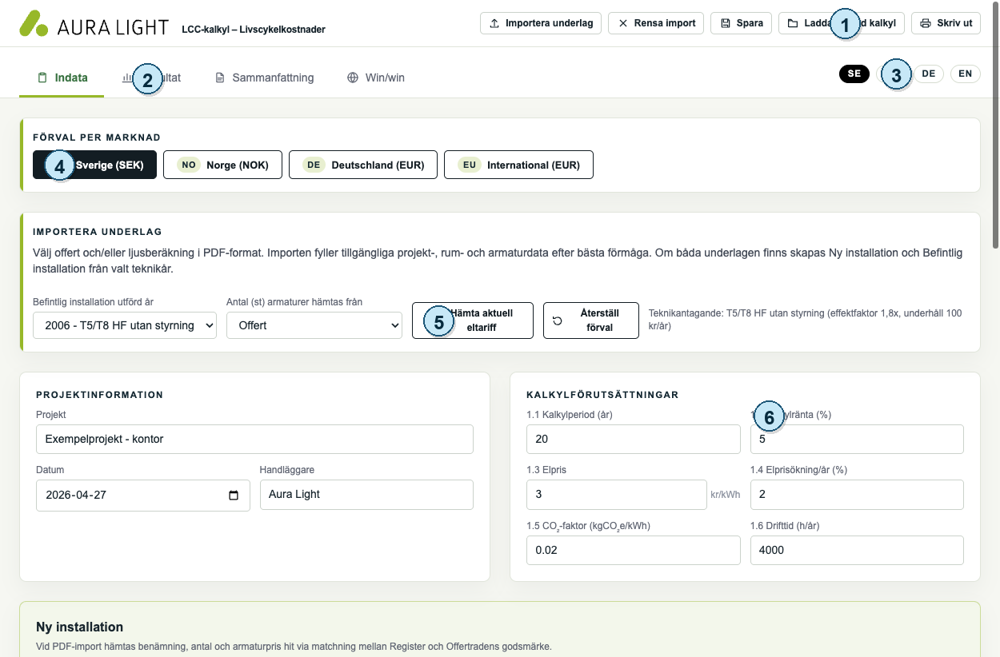
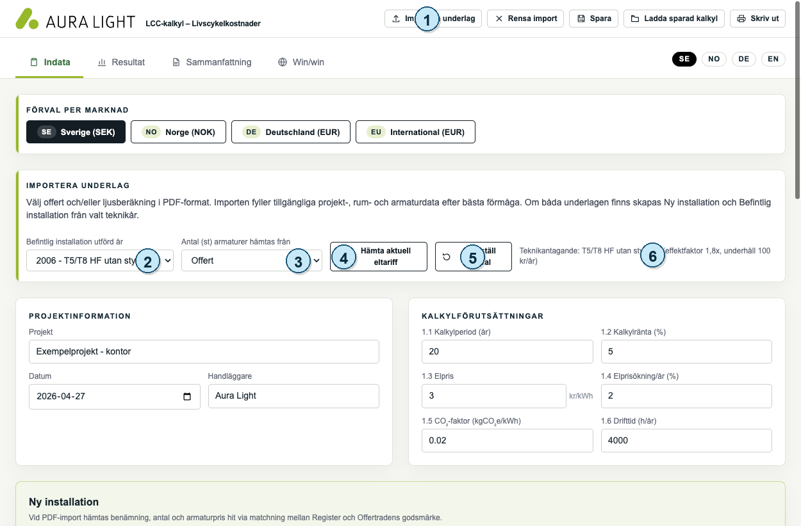
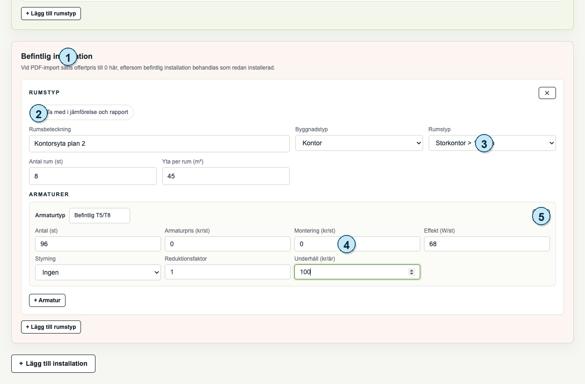
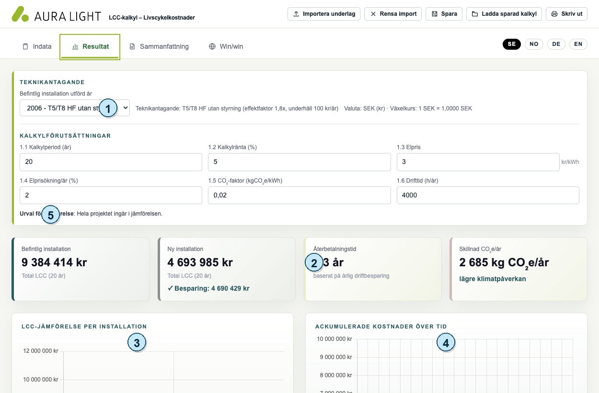
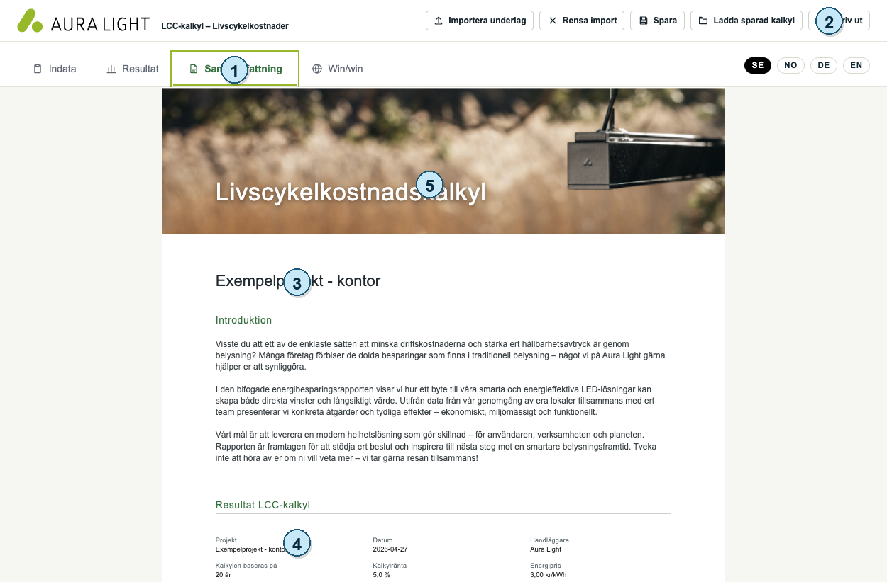
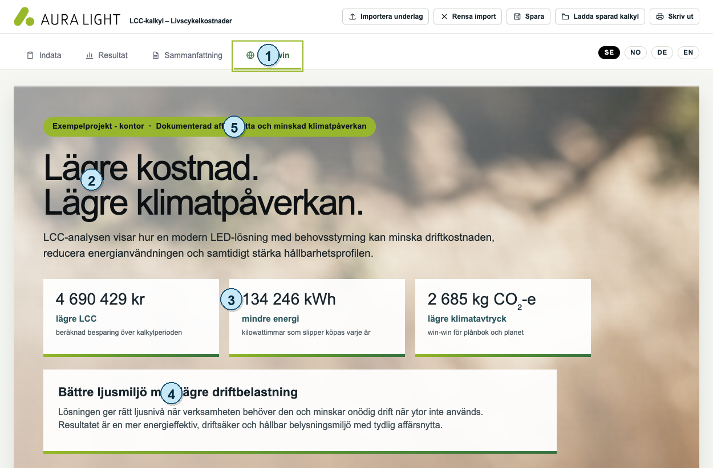

# Aura Light LCC-kalkylator - kort bildmanual

Manualen är uppbyggd så att du arbetar från vänster till höger i tjänsten: `Indata`, `Resultat`, `Sammanfattning` och `Win/win`.

Varje sida har en bild med siffror. Läs siffran i bilden och motsvarande korta förklaring under bilden.

## Sida 1. Huvudmeny och fasta knappar

1. `Spara`, `Ladda sparad kalkyl` och `Skriv ut`: används när kalkylen ska sparas, öppnas igen eller skrivas ut som rapport.
2. Flikar: använd dem från vänster till höger: `Indata`, `Resultat`, `Sammanfattning`, `Win/win`.
3. Språkval: välj `SE`, `NO`, `DE` eller `EN` för gränssnitt och rapporttext.
4. Marknad: väljer valuta och förvalda marknadsantaganden.
5. Import: används för att läsa in offert och/eller ljusberäkning.
6. Projektdata och kalkylförutsättningar: grundvärden som används i hela kalkylen.

## Sida 2. Huvudmenyknapparnas funktion

1. `Importera underlag`: välj PDF-filer från offert och/eller ljusberäkning.
2. `Befintlig installation utförd år`: väljer antaget teknikår för befintlig installation.
3. `Antal (st) armaturer hämtas från`: välj om antal ska tas från offert eller DIALux.
4. `Hämta aktuell eltariff`: hämtar aktuell elprisdata när hjälptjänsten körs.
5. `Återställ förval`: återställer marknadens standardvärden.
6. Teknikantagande: visar vilken effektfaktor och underhållskostnad som används för befintlig installation.

## Sida 3. Indata

1. Installation: visar om du arbetar med `Ny installation` eller `Befintlig installation`.
2. `Ta med i jämförelse och rapport`: styr om rummet ingår i beräkning och rapport.
3. Rumsdata: fyll i rumsbeteckning, byggnadstyp, rumstyp, antal rum och yta.
4. Armaturdata: fyll i armaturtyp, antal, pris, montering, effekt, styrning, reduktionsfaktor och underhåll.
5. Lägg till eller ta bort: använd knapparna för att justera rum och armaturer.

## Sida 4. Resultat

1. Teknik- och kalkylantaganden: kontrollera teknikår, kalkylperiod, ränta, elpris, CO2-faktor och drifttid.
2. KPI-kort: visar total LCC, besparing, återbetalningstid och CO2-skillnad.
3. LCC per installation: jämför investerings-, energi- och underhållskostnader.
4. Ackumulerad kostnad: visar kostnadsutveckling över kalkylperioden.
5. Urval för jämförelse: visar om hela projektet eller valda rum ingår.

## Sida 5. Sammanfattning

1. `Sammanfattning`: visar rapporten så som den ska granskas före PDF.
2. `Skriv ut`: öppnar webbläsarens utskriftsdialog.
3. Projektinformation: visar projekt, datum och handläggare i rapporten.
4. Resultatsektion: visar kundens sammanfattade LCC-resultat.
5. Layoutkontroll: kontrollera text, bilder, tabeller och diagram innan rapporten sparas.

## Sida 6. Win/win

1. `Win/win`: öppnar en mer sälj- och kundorienterad resultatvy.
2. Huvudbudskap: sammanfattar nyttan med lägre kostnad och lägre klimatpåverkan.
3. Nyckeltal: visar besparing, minskad energi och minskat klimatavtryck.
4. Affärsnytta: kort text som kan användas i kunddialogen.
5. Projekt och värdeerbjudande: visar vilket projekt sidan gäller och vilken nytta som lyfts.

## Sida 7. Kort arbetsgång

1. Välj språk.
2. Välj marknad.
3. Importera underlag eller fyll i indata manuellt.
4. Kontrollera projektinformation och kalkylförutsättningar.
5. Kontrollera ny och befintlig installation.
6. Öppna `Resultat` och granska KPI, diagram och tabeller.
7. Öppna `Sammanfattning` och kontrollera rapporten.
8. Använd `Win/win` vid kunddialog.
9. Spara kalkylen.
10. Skriv ut eller spara rapporten som PDF.

## Viktigt före kunddelning

Kontrollera alltid importerade värden, driftstider, elpris, kalkylperiod, ränta, CO2-faktor, armaturpriser och vilka rum som ingår innan rapporten skickas till kund.
